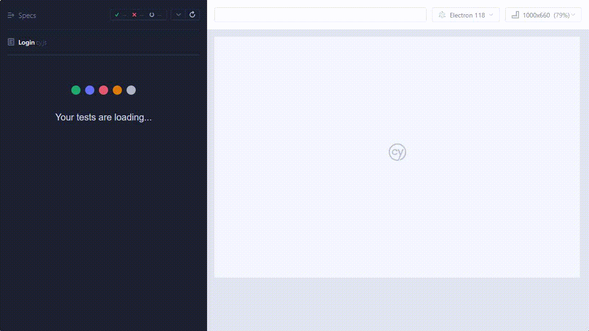

<h1 align="center">
    
</h1>
<h1 align="center">
    
</h1>

## 📋 Sobre

**Projeto** foi criado para introdução do Cypress pela Qa.Coders

## 🚀 Tecnologias
- [CSS](https://developer.mozilla.org/pt-BR/docs/Web/CSS)
- [JavaScript](https://developer.mozilla.org/pt-BR/docs/Aprender/JavaScript)
- [Npm](https://www.npmjs.com/)
- [Node](https://nodejs.org/en/)


## 🛠️ Tools
- [Cypress](https://www.cypress.io/)
- [Visual Studio Code](https://code.visualstudio.com)
- [Git](https://git-scm.com/)

## 🔍 Fontes

- [Many | Teste e Qualidade de Software](https://www.youtube.com/watch?v=MW0QLdZHNGw) - GitActions
- [Walmyr TaT](https://talkingabouttesting.com/) - Cypress

## 🎮 Como usar
```
1. Clonando o repositório 
$ git clone git@github.com:clestonv/cypress-techlead.git

2. Acessando o diretório do projeto 
$ cd cypress-techlead

3. Instalando as dependências 
$ npm -i --force

4. Executando Modo Headless
$ npm run run:test


Feito por Cleberson Osorio 🌊

